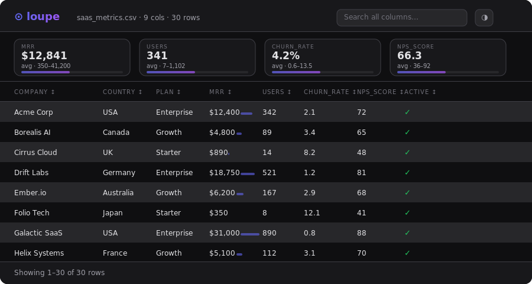

<div align="center">


<h1>loupe</h1>

<p>
Turn any CSV or JSON into a beautiful, interactive HTML dashboard.<br>
One command. Zero dependencies.
</p>

<br>



</div>

## Why

You have a CSV. You want to explore it — sort, filter, search, see some stats. Your options:

- **Excel / Google Sheets** — import, wait, click around, can't share without an account
- **Pandas + Jupyter** — `pip install`, open notebook, write `df.head()`, realize you need more code
- **Observable / Datasette** — serious tools for serious setups. You just want to look at data.

**loupe** takes any CSV or JSON and spits out a single `.html` file. Open it in any browser, offline, forever. Sort columns, search across everything, get stats on numeric columns automatically.

The output file has no external dependencies — no CDN calls, no server, no JS framework. It's just a well-crafted HTML file.

<br>

## Install

```bash
pip install loupe-cli
```

Or just grab the file directly — it's a single Python script with zero dependencies beyond the standard library:

```bash
curl -O https://raw.githubusercontent.com/Jah-yee/loupe/main/loupe.py
```

<br>

## Usage

```bash
# CSV file
python loupe.py sales.csv -o sales.html

# JSON file
python loupe.py users.json -o users.html

# Pipe from stdin
cat data.csv | python loupe.py - -o dashboard.html

# Force format (if extension doesn't match)
python loupe.py export.txt --format csv -o out.html
```

Then open the output file in your browser.

<br>

## What you get

**Table**
- Sort by any column (click headers)
- Full-text search across all columns at once
- Pagination (50 rows per page)
- Inline mini-bar charts for numeric columns — see distribution at a glance

**Stats cards**
- Auto-detected for numeric columns: avg, min, max, distribution bar
- Up to 5 cards shown by default

**Column type detection**
- `number` — integers, floats, currency ($1,234), percentages (42%)
- `date` — ISO 8601, US, European, and more
- `boolean` — true/false, yes/no, 1/0 render as ✓ / ✗
- `text` — everything else

**Dark / light mode**
- Toggle in the top right corner

**Output**
- Single `.html` file — ~10–20kb for most datasets
- Works fully offline
- Embeds all data inline — no external files needed
- Shareable: send the html file directly

<br>

## Examples

**SaaS metrics CSV → dashboard:**
```bash
python loupe.py saas_metrics.csv -o saas_metrics.html
# ✓ saas_metrics.html (16kb · 30 rows · 9 columns)
```

**npm package stats JSON → dashboard:**
```bash
python loupe.py npm_packages.json -o npm_packages.html
# ✓ npm_packages.html (13kb · 20 rows · 7 columns)
```

<br>

## JSON formats

loupe handles common JSON shapes automatically:

```json
// Plain array (most common)
[{"id": 1, "name": "Alice"}, ...]

// Wrapped in a common key
{"data": [...]}
{"rows": [...]}
{"results": [...]}
{"items": [...]}
```

<br>

## How It Works

1. Parse CSV with `csv.DictReader` or JSON with `json.loads` — pure stdlib, no pandas
2. Auto-detect each column's type by scanning values
3. Compute stats (min/max/mean) for numeric columns
4. Inject data as a `const DATA = [...]` block inside a self-contained HTML template
5. The JS (< 100 lines, no framework) handles sort, filter, search, pagination at runtime

The template — CSS variables for theming, sticky headers, monospace numbers, inline bar charts — is all hand-crafted, no build step.

<br>

## Supported input

Everything that outputs CSV or JSON — databases, APIs, spreadsheets, BI tools, logs, `jq`, `psql -c "\copy ..."`, `gh api`, you name it.

```bash
# GitHub repo stats via gh CLI
gh api /repos/torvalds/linux/contributors | python loupe.py - -o contributors.html

# PostgreSQL query result
psql -c "COPY (SELECT * FROM orders) TO STDOUT WITH CSV HEADER" | python loupe.py - -o orders.html

# AWS Cost Explorer export
python loupe.py aws-cost-export.csv -o costs.html
```

<br>

## Contributing

Issues and PRs welcome. Some ideas on the roadmap:

- [ ] Column hiding / reordering
- [ ] CSV export of filtered results
- [ ] Configurable page size (`--page-size 100`)
- [ ] Chart view for numeric columns (bar / scatter)
- [ ] Custom column type overrides (`--types col:number,date_col:date`)
- [ ] `--title` flag to set dashboard title

<br>

## License

MIT

<br>

<div align="center">
<sub>One command. One file. Your data, explorable.</sub>
</div>
